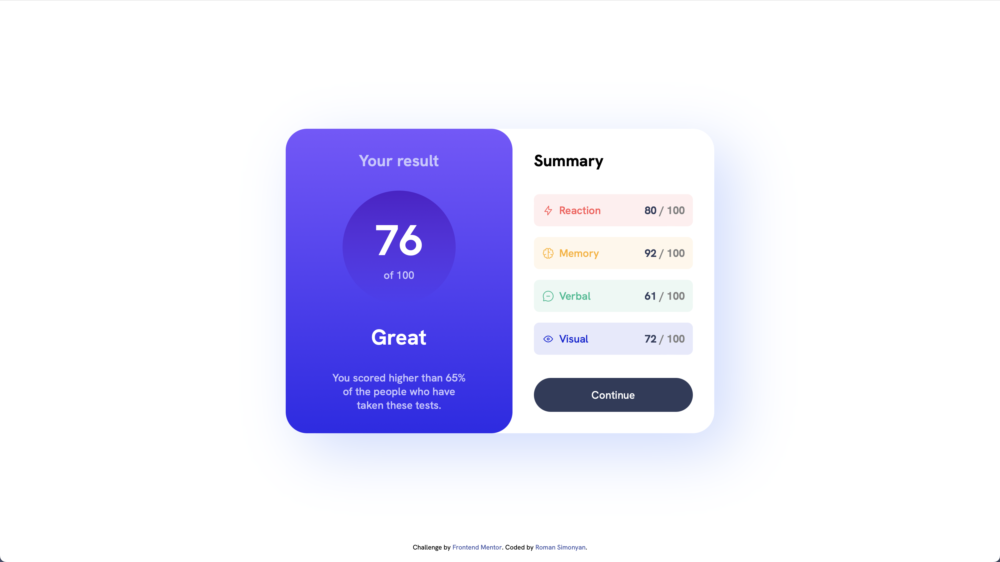
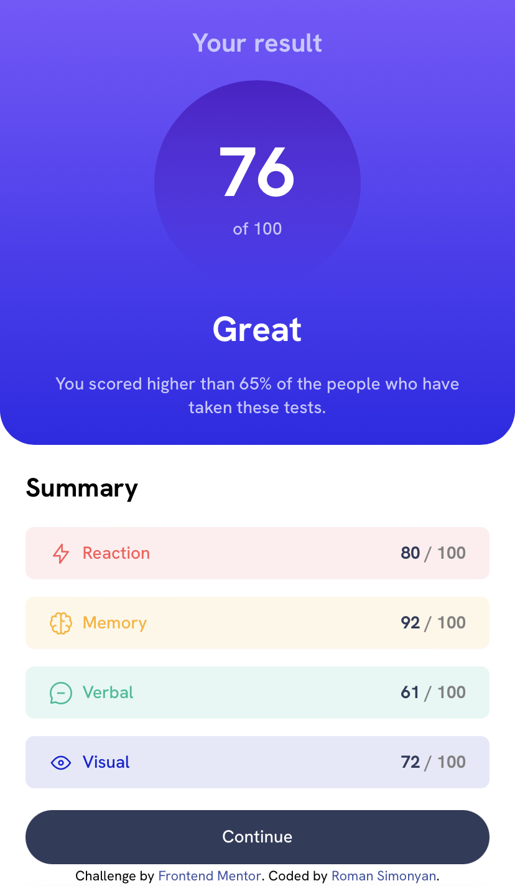

# Frontend Mentor - Results summary component solution

This is a solution to the [Results summary component challenge on Frontend Mentor](https://www.frontendmentor.io/challenges/results-summary-component-CE_K6s0maV). Frontend Mentor challenges help you improve your coding skills by building realistic projects.

## Table of contents

- [Overview](#overview)
  - [The challenge](#the-challenge)
  - [Screenshot](#screenshot)
  - [Links](#links)
- [My process](#my-process)
  - [Built with](#built-with)
  - [What I learned](#what-i-learned)
- [Author](#author)

## Overview

### The challenge

Users should be able to:

- View the optimal layout for the interface depending on their device's screen size
- See hover and focus states for all interactive elements on the page

### Screenshot




### Links

- Solution URL: https://github.com/simonyanroman/results-summary-component
- Live Site URL: https://simonyanroman.github.io/results-summary-component/

## My process

### Built with

- Semantic HTML5 markup
- CSS custom properties
- Flexbox
- Desktop-first workflow

### What I learned

I improved my skills in controlling HTML with JavaScript.

Implementing querySelector instead of getElementByID

```js
let reactionResult = document.querySelector("#reaction-result");
let memoryResult = document.querySelector("#memory-result");
let verbalResult = document.querySelector("#verbal-result");
let visualResult = document.querySelector("#visual-result");

let overallScore = document.querySelector("#overall-score");
```

Writing values to textContent of HTML text elements

```js
async function request() {
  const response = await fetch("./data.json");
  const data = await response.json();

  for (let i = 0; i < data.length; i++) {
    switch (data[i].category) {
      case "Reaction":
        reactionResult.textContent = data[i].score;
      case "Memory":
        memoryResult.textContent = data[i].score;
      case "Verbal":
        verbalResult.textContent = data[i].score;
      case "Visual":
        visualResult.textContent = data[i].score;
    }
  }

  scoresArr.push(
    parseInt(reactionResult.textContent),
    parseInt(memoryResult.textContent),
    parseInt(verbalResult.textContent),
    parseInt(visualResult.textContent)
  );

  overallScore.textContent = average(scoresArr);
```

## Author

- Website - [Roman Simonyan](https://www.linkedin.com/in/simonyanrr)
- Frontend Mentor - [@simonyanroman](https://www.frontendmentor.io/profile/simonyanroman)
